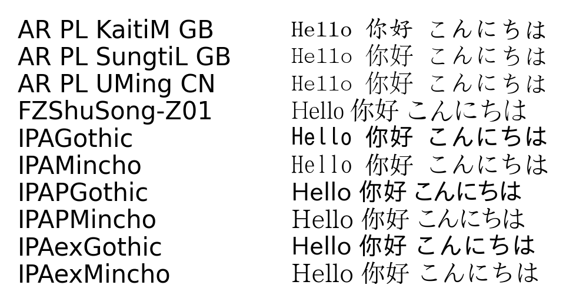

# mplfontutils

A utility package for testing and loading fonts in matplotlib.

## Installation

### Using pip

```shell
pip install mplfontutils
```

### Using uv (recommended)

```shell
# Install as a tool (for command-line usage)
uv tool install mplfontutils

# Or add to your project
uv add mplfontutils
```

## Usage

### Command Line

Test which fonts can display `Hello 世界`:

```shell
# Direct execution in the environment (after pip install or uv add)
mplfontutils "Hello 世界"

# Using uv tool run
uv tool run mplfontutils "Hello 世界"

# Traditional module execution
python -m mplfontutils "Hello 世界"
```

#### Output Visualization

Use the `-o` or `--output` parameter to save a visualization image showing the test text rendered in all compatible fonts:

```shell
# Save visualization to a PNG file
mplfontutils "Hello 你好 こんにちは" -o font_test.png
```



### Python API

```python
from mplfontutils import find_available_fonts, load_fonts_from_directory

# Load fonts from directory
load_fonts_from_directory("/path/to/fonts")

# Find compatible fonts
fonts = find_available_fonts("中文测试")
print(f"Found {len(fonts)} compatible fonts")
```

## License

[MIT License](LICENSE)
